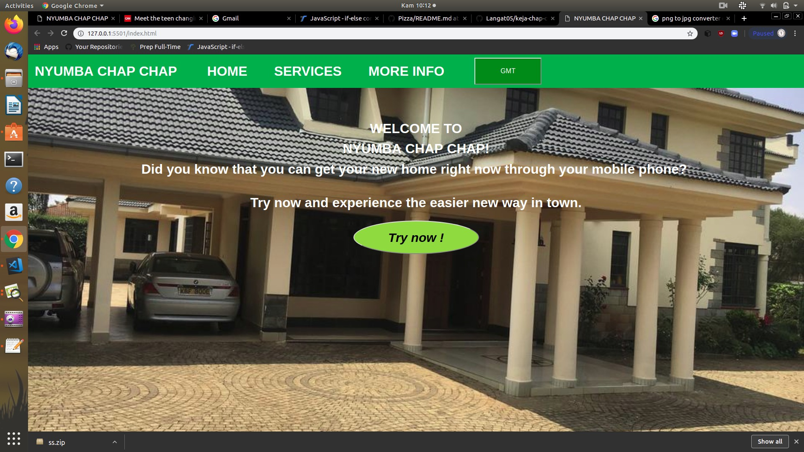

# NYUMBA-CHAPCHAP

## DESCRIPTION

- This is a website which has been designed to deal with the challenges faced by people whenever they decide to go renting. It allows the user to search for residence in his or her location of interest get to know the condition of the house the price and if it suits their interest they can decide to go on and Book.

## PROJECT SCREENSHOT

- 

## SET UP INSTRUCTIONS

- Open Terminal {Ctrl+Alt+T}

- git clone https://github.com/Langat05/keja-chap-chap

- cd keja-chap-chap

- code . if you are using vs code or atom . if you are using windows

## TECHNOLOGIES USED

- HTML5
- CSS
- Bootstrap
- jQuery

## BDD

- The user(s)  is able to locate their interest, confirm status of the house of interest and eventually go on and book or opt to for more information if there arises a need of clarificatiion.

## CONTACT INFORMATION

- Any contribution to better this project can be sent to us through:
- justuslangat78@gmail.com
- dennismwau33@gmail.com
- lilian.munyekenye@aiu.ac.ke
- jonahmakori0@gmail.com

## LICENSE

- Copyright (c) 2019.LANGAT K JUSTUS.JONAH MAKORI.LILIAN MUNYEKENYE.DENNIS MWAU.

    Permission is hereby granted, free of charge, to any person obtaining a copy of this software and associated documentation files (the "Software"), to deal in the Software without restriction, including without limitation the rights to use, copy, modify, merge, publish, distribute, sublicense, and/or sell copies of the Software, and to permit persons to whom the Software is furnished to do so, subject to the following conditions:

    The above copyright notice and this permission notice shall be included in all copies or substantial portions of the Software.

    THE SOFTWARE IS PROVIDED "AS IS", WITHOUT WARRANTY OF ANY KIND, EXPRESS OR IMPLIED, INCLUDING BUT NOT LIMITED TO THE WARRANTIES OF MERCHANTABILITY, FITNESS FOR A PARTICULAR PURPOSE AND NONINFRINGEMENT. IN NO EVENT SHALL THE AUTHORS OR COPYRIGHT HOLDERS BE LIABLE FOR ANY CLAIM, DAMAGES OR OTHER LIABILITY, WHETHER IN AN ACTION OF CONTRACT, TORT OR OTHERWISE, ARISING FROM, OUT OF OR IN CONNECTION WITH THE SOFTWARE OR THE USE OR OTHER DEALINGS IN THE SOFTWARE.

## AUTHORS

- <b>Langat Justus</b>

- <b>Dennis Mwau</b>

- <b>Lilian Munyekenye</b>

- <b>Jonah Makori</b>
